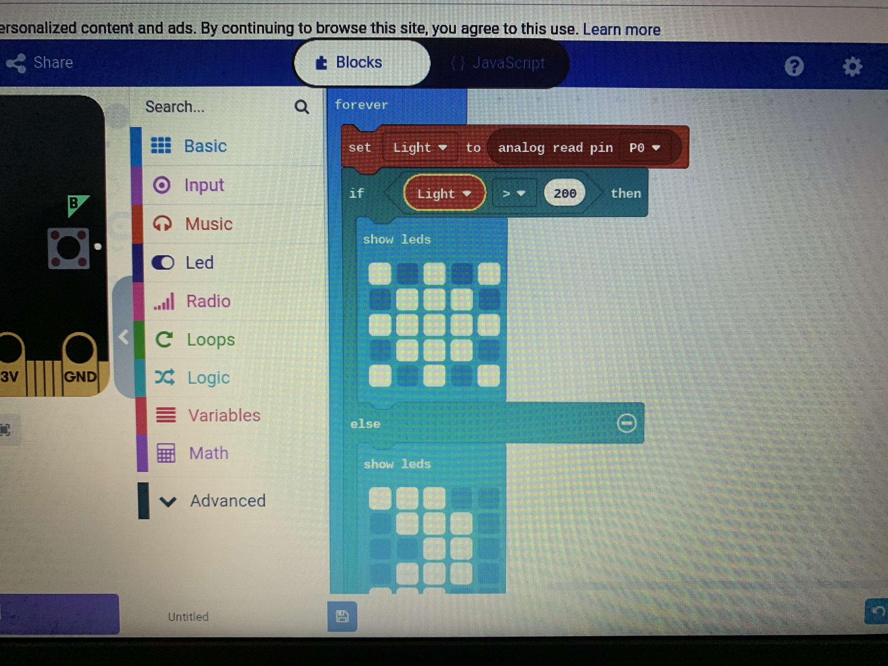
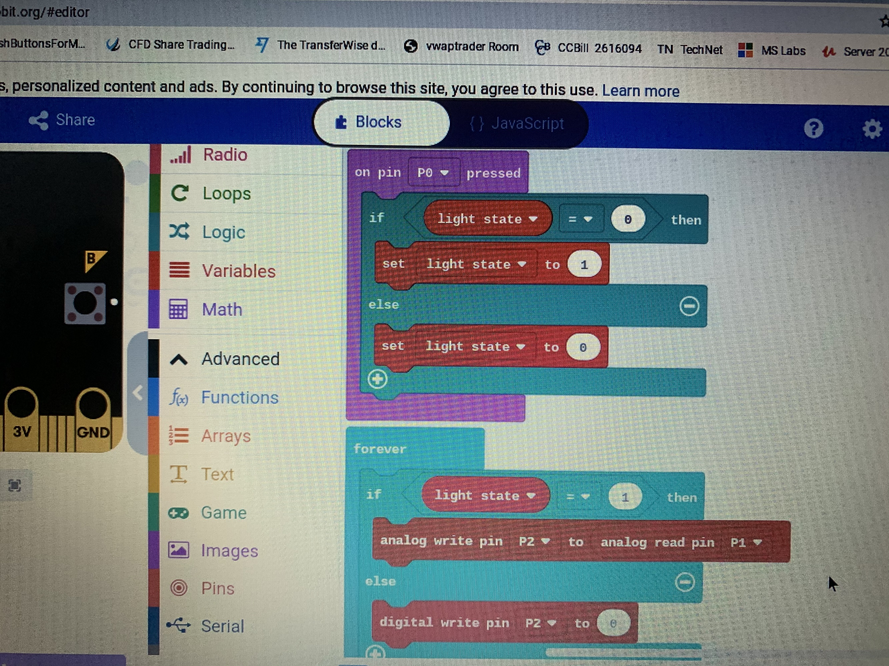
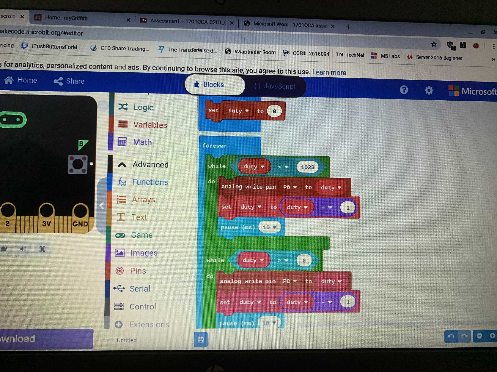
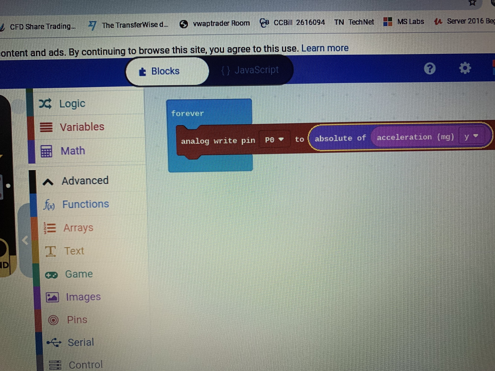

# Inventor Kit Experiments

*Markdown reference: https://guides.github.com/features/mastering-markdown/*

## Instructions ##

*For a selection of 5 inventor kit experiments that you choose, fill out the following sections.

### Experiment 1 - Say Hello to the BBC Micro:Bit ###

https://youtu.be/_JRkIOC3vMw

This experiment displays a smiley face and the text “Hello World” when the buttons are pressed.

#### Reflection ####

In this experiment, something new to me was or something I learned was the basics of the micro:bit and its code, and what this course will teach me.

This experiment could be the basis of a real world application such as a sign advertising a business.

### Experiment 2 – Using a Light Sensor & Analog Inputs ###

https://youtu.be/KZDmhy2dEBE

This experiment displays a moon image when no light is detected by the sensor, and a sun image when light is detected.

#### Reflection ####

In this experiment, something new to me was or something I learned was how a light sensor works and how to incorporate it into a circuit.

This experiment could be the basis of a real world application such as street lights turning on when dark and off when sunny.

### Experiment 3 – Dimming an LED Using a Potentiometer ###

https://youtu.be/16caepzuRr8

This experiment turns a red LED on and off using the buttons, and increased or decreases the brightness depending on which way the potentiometer is turned.

#### Reflection ####

In this experiment, something new to me was or something I learned was how a potentiometer can be used to increase the brightness of an LED.

This experiment could be the basis of a real world application such as a flashlight to save power when max brightness isn’t needed.

### Experiment 4 – Using a Transistor to Drive a Motor ###

https://youtu.be/HtBI5nZxccM

This experiment turns on a motor to spin a fan at increasing and decreasing speed.

#### Reflection ####

In this experiment, something new to me was or something I learned was how to turn on a motor and change the speed.

This experiment could be the basis of a real world application such as a theme park ride with changing speeds.

### Experiment 5 – Using the Accelerometer to Control Motor Speed ###

https://youtu.be/NifJpKR308o

This experiment uses the same setup as Experiment 4, however it changes the motor to spin faster or slower depending on the angle that the micro:bit is held.

#### Reflection ####

In this experiment, something new to me was or something I learned was how something can be affected by the angle at which a micro:bit is being held.

This experiment could be the basis of a real world application such as a toy that changes features depending on how it is held.

